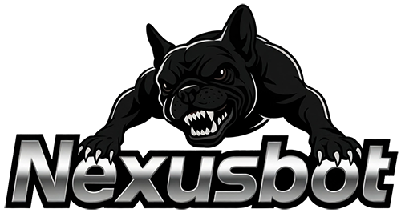

# NexusBot | OpenClaw Chinese Edition

  

  <strong>Ready-to-use OpenClaw Chinese Edition | DingTalk/Feishu/WeCom | Local Models | Privacy First</strong> 
  <strong>开箱即用的 OpenClaw 中文版 | 支持钉钉/飞书/企微 | 本地模型 | 隐私优先</strong>

  <a href="./README.md">简体中文</a> •
  <a href="./README.en.md">English</a> •
  <a href="./README.ja.md">日本語</a>

  
  
  
  
  

---

## 🦞 What is NexusBot?

**Official Website**: [www.markovmod.com](https://www.markovmod.com)

**NexusBot** is a deeply customized Chinese edition based on [OpenClaw](https://openclaw.ai/), designed for Chinese users and enterprises.

[OpenClaw](https://openclaw.ai/) is an open-source personal AI assistant platform created by Peter Steinberger ([@steipete](https://github.com/steipete)), with over **100,000+ Stars** on GitHub.

### 🌟 Deep Development Based on OpenClaw

NexusBot is not just a translation, but a deep customization based on OpenClaw:

- ✅ **Complete Community Ecosystem** - Inherits 20+ super built-in skills and 8000+ ecosystem skills (continuously growing)
- ✅ **One-Click Installation** - Graphical interface, install massive skills with one click
- ✅ **Custom Skill Development** - Support custom skills for specific needs
- ✅ **Self-developed & Deep Integration** - Continuous optimization, maintaining technical leadership
- ✅ **Chinese Deep Optimization** - Not just translation, but localized experience

### 🎯 Core Pain Points Solved

| Pain Point | OpenClaw Official | NexusBot Solution |
|------------|-------------------|-------------------|
| 🔧 **Complex Installation** | Command line, environment variables | ✅ Double-click EXE, zero threshold |
| 🌐 **Poor Chinese Support** | English interface, missing Chinese docs | ✅ Complete Chinese interface and docs |
| 💬 **No Chinese Platforms** | Only Telegram/Discord | ✅ Native DingTalk/Feishu/WeCom support |
| 🔑 **Difficult API Config** | Manual config file editing | ✅ Graphical config, one-click test |
| 💰 **High Cost** | Depends on foreign APIs, expensive | ✅ Support local models, completely free |
| 🔒 **Privacy Concerns** | Data sent to cloud | ✅ Local models, data stays local |
| 🚫 **Network Restrictions** | Need access to foreign services | ✅ Support Chinese AI models and platforms |

### Core Features

| Feature | Description |
|---------|-------------|
| 🖥️ **Runs Locally** | Windows/macOS/Linux, data always local, privacy first |
| 💬 **Chinese Messaging Platforms** | Native support for DingTalk, Feishu, WeCom |
| 🌏 **Multi-language Support** | Full support for Chinese, English, Japanese interface and docs |
| 🤖 **Local AI Models** | Support Ollama/LM Studio, data stays local, completely free |
| 🔌 **Massive Skill Plugins** | 20+ super built-in skills and 8000+ ecosystem skills (continuously growing), one-click install, custom development |
| 🧠 **Persistent Memory** | Remember your preferences, context, become your personal AI |
| 🌐 **Browser Control** | Auto browse web, fill forms, extract data |
| ⚡ **Full System Access** | Read/write files, run scripts, execute commands |

### 🔌 Complete Skill Ecosystem

| Feature | Description |
|---------|-------------|
| 📦 **8000+ Community Skills** | Inherit OpenClaw's complete ecosystem (continuously growing) |
| 🖱️ **One-Click Backend Install** | Graphical interface, search, preview, install seamlessly |
| 🎨 **Custom Skill Development** | Support custom skills for enterprise needs |
| 🔄 **Auto Update** | Skills auto-detect updates, stay current |
| 🏪 **Skill Marketplace** | Browse, rate, share, active community |

**Popular Skills**:
- **1Password** - Password management integration
- **Apple Notes** - Note synchronization
- **GitHub** - Code repository management
- **Jira** - Project management
- **Slack** - Team collaboration
- **More...** 8000+ skills to explore

### 💎 Advantages of Local Models

| Advantage | Description |
|-----------|-------------|
| 🔒 **Absolute Privacy** | All conversation data stays local, enterprise secrets completely safe |
| 💰 **Zero Cost** | No API purchase, no usage limits, completely free |
| 🚀 **Faster Response** | Local inference, no network latency, second-level response |
| 🌐 **Offline Available** | No internet needed, works on planes, subways |
| 🎯 **Customizable** | Can fine-tune models for specific domains |
| 📊 **Unlimited** | No API rate limits, use as much as you want |

**Supported Local Models**:
- **Ollama** - Most popular local model runner, supports Llama, Qwen, DeepSeek, etc.
- **LM Studio** - Graphical interface, easy to use
- **LocalAI** - OpenAI API compatible local service

