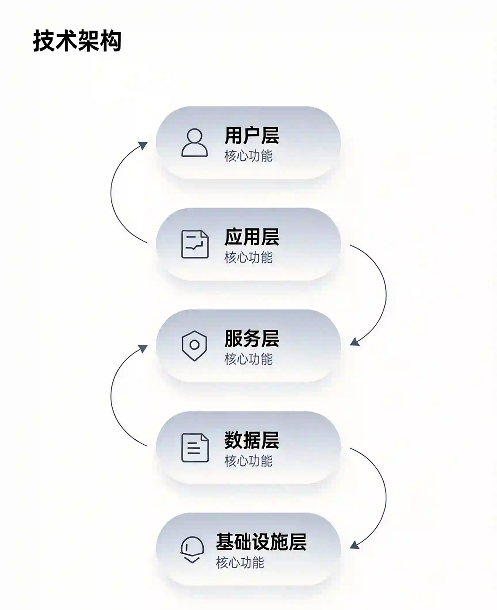
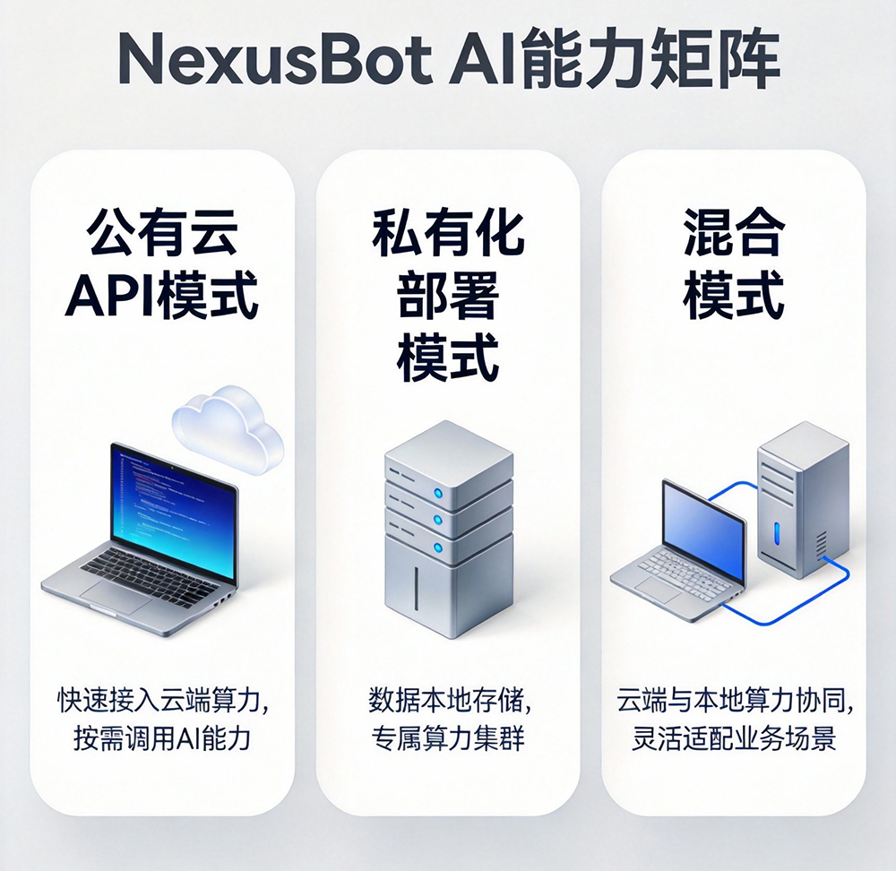
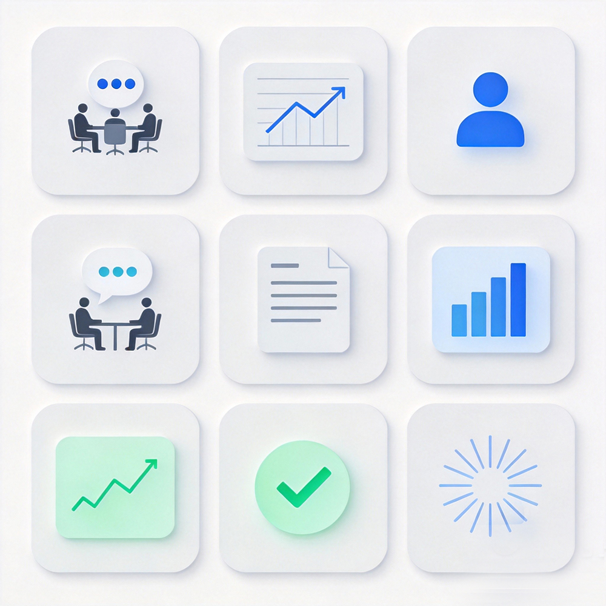

# NEUXSBOT

## OpenClaw Chinese Edition with GUI One-Click Setup

NEUXSBOT is a China-focused OpenClaw edition designed for active execution workflows, not just passive chat.

- GUI-first product experience
- One-click install path for desktop users
- Strong focus on IDE-based code development
- Multi-model orchestration and extensible skills

For bilingual details, see [README.md](./README.md).

---

## Key Highlights

### IDE-Centered Code Development

- Built-in `NEUXSBOT IDE` for real development tasks
- Continuous workflow: requirement -> code -> refine
- Multi-turn context, task history, and skill-enhanced coding

### GUI One-Click Installation

- Visual entry for setup and configuration
- Windows / macOS / Linux download support
- Optional CLI quick install mode

### OpenClaw Chinese Edition Experience

- Chinese-first docs and localization
- Enterprise communication scenario adaptation
- Visual model / workflow / skill configuration

### Multi-Model + Skills

- Cloud and local model switching
- Local model support (e.g., Ollama)
- Extensible skill system for coding, documents, and automation

### Data Analysis Subsystem

- Multi-dimensional probability analysis workspace
- Markov chain, LSTM, and XGBoost-oriented analysis ideas
- Multi-analyzer and backtesting-oriented workflow

---

## Web Modules (from local frontend structure)

| Module | Route | Purpose |
|---|---|---|
| Home | `/` | AI OS overview |
| IDE | `/ide` | Coding and execution workspace |
| NBPHONE | `/product/phone` | Product direction page |
| Data Analysis | `/data-analysis` | Analysis lab |
| Docs | `/docs` | Quick start and configuration guides |
| Download | `/download` | Multi-platform install entry |
| Enterprise | `/enterprise` | Enterprise workflow direction |
| Member | `/member` | Account and console features |

---

## Visual Assets

  

  

  

---

## Repository Scope

- Product profile and public documentation repository
- Full business source code is not included
- UI demo assets (GIF/interface demos) are temporarily removed

---

## Links

- Website: [https://www.neuxsbot.com](https://www.neuxsbot.com)
- Docs: [https://www.neuxsbot.com/docs](https://www.neuxsbot.com/docs)
- Download: [https://www.neuxsbot.com/download](https://www.neuxsbot.com/download)
- Issues: [https://github.com/Markovmodcn/openclaw-china/issues](https://github.com/Markovmodcn/openclaw-china/issues)

