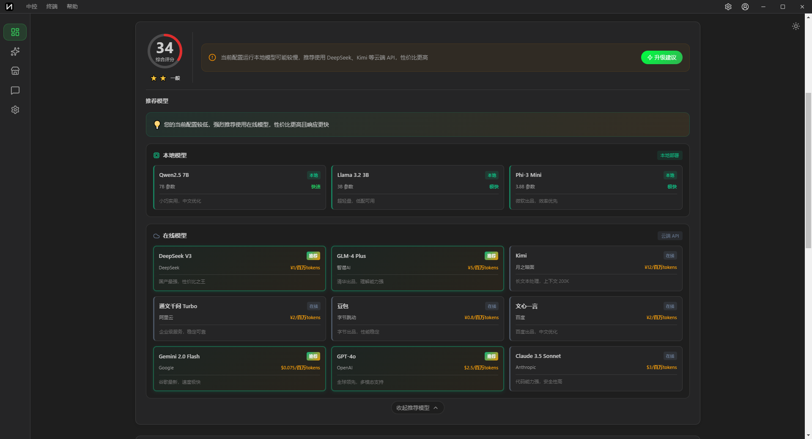
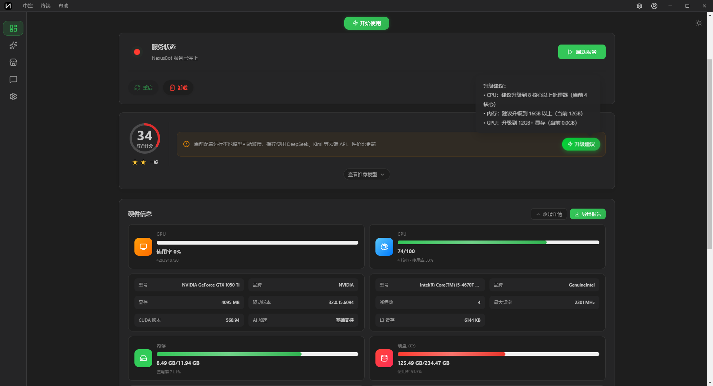
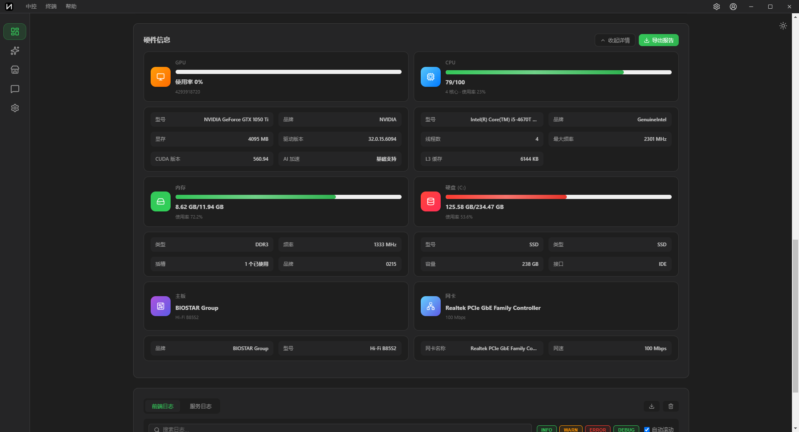
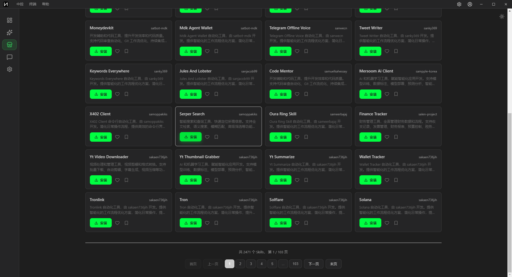
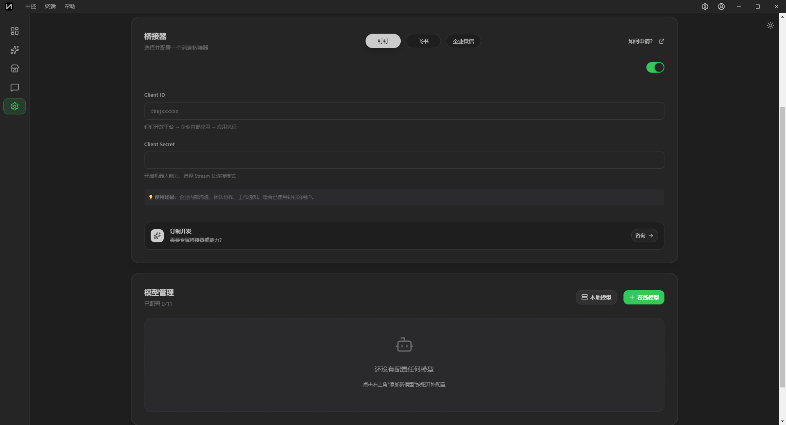

# NexusBot | OpenClaw 中文版 | AI 工作流自动化 | 钉钉/飞书/企微机器人 | 国人专属

<p align="center">
  
</p>

<p align="center">
  <strong>开箱即用的 OpenClaw 中文版 | 支持钉钉/飞书/企微 | 本地模型 | 隐私优先</strong><br>
  <strong>Ready-to-use OpenClaw Chinese Edition | DingTalk/Feishu/WeCom | Local Models | Privacy First</strong>
</p>

<p align="center">
  <strong>✨ 支持 Windows / macOS / Linux 系统 | 一键安装 | 无需复杂脚本 ✨</strong>
</p>

<p align="center">
  <a href="./README.md">简体中文</a> •
  <a href="./README.en.md">English</a> •
  <a href="./README.ja.md">日本語</a>
</p>

<p align="center">
  
  
  
  
  
</p>

---

## 🦞 什么是 NexusBot？

<p align="center">
  <strong>🌐 官网: <a href="https://www.markovmod.com" target="_blank">www.markovmod.com</a></strong>
</p>

**NexusBot** 是基于 [OpenClaw](https://openclaw.ai/) 深度开发的中文版发行版，专为中文用户和企业打造。

[OpenClaw](https://openclaw.ai/) 是由 Peter Steinberger ([@steipete](https://github.com/steipete)) 创建的开源个人 AI 助手平台，在 GitHub 上拥有超过 **100,000+ Stars**。

### 🌟 基于 OpenClaw 深度开发

NexusBot 不是简单的汉化版本，而是基于 OpenClaw 的深度定制开发：

- ✅ **完整社区生态** - 继承插件市场 3000+ 技能插件生态
- ✅ **后台一键安装** - 图形化界面，海量 Skills 一键安装
- ✅ **订制技能开发** - 支持自定义技能，满足特定需求
- ✅ **自研且与官方深度对接** - 持续优化改进，保持技术领先
- ✅ **中文深度优化** - 不仅是翻译，更是本地化体验

### 🎯 解决的核心痛点

<table>
<thead>
<tr>
<th width="20%">痛点</th>
<th width="35%">OpenClaw 官方版</th>
<th width="45%">NexusBot 解决方案</th>
</tr>
</thead>
<tbody>
<tr>
<td>🔧 <strong>安装复杂</strong></td>
<td>需要命令行、配置环境变量</td>
<td>✅ 双击 EXE 即可，零门槛</td>
</tr>
<tr>
<td>🌐 <strong>中文支持差</strong></td>
<td>英文界面，中文文档缺失</td>
<td>✅ 完整中文界面和文档</td>
</tr>
<tr>
<td>💬 <strong>国内平台不支持</strong></td>
<td>只支持 Telegram/Discord</td>
<td>✅ 原生支持钉钉/飞书/企微</td>
</tr>
<tr>
<td>🔑 <strong>API 配置难</strong></td>
<td>手动编辑配置文件</td>
<td>✅ 图形化配置，一键测试</td>
</tr>
<tr>
<td>💰 <strong>成本高</strong></td>
<td>依赖国外 API，费用高</td>
<td>✅ 支持本地模型，完全免费</td>
</tr>
<tr>
<td>🔒 <strong>隐私担忧</strong></td>
<td>数据发送到云端</td>
<td>✅ 本地模型，数据不出本地</td>
</tr>
<tr>
<td>🚫 <strong>网络限制</strong></td>
<td>需要访问国外服务</td>
<td>✅ 支持国内 AI 模型和平台</td>
</tr>
</tbody>
</table>


### 核心特性

<table>
<thead>
<tr>
<th width="25%">特性</th>
<th width="75%">说明</th>
</tr>
</thead>
<tbody>
<tr>
<td>🖥️ <strong>运行在本地</strong></td>
<td>Windows/macOS/Linux，数据始终在本地，隐私优先</td>
</tr>
<tr>
<td>💬 <strong>中文消息平台</strong></td>
<td>原生支持钉钉、飞书、企业微信</td>
</tr>
<tr>
<td>🌏 <strong>多语言支持</strong></td>
<td>完整支持中文、英文、日语界面和文档</td>
</tr>
<tr>
<td>🤖 <strong>本地 AI 模型</strong></td>
<td>支持 Ollama/LM Studio，数据不出本地，完全免费</td>
</tr>
<tr>
<td>🔌 <strong>海量技能插件</strong></td>
<td>3000+ 社区技能（不断增加中...），后台一键安装，支持订制开发</td>
</tr>
<tr>
<td>🧠 <strong>持久记忆</strong></td>
<td>记住你的偏好、上下文，成为专属于你的 AI</td>
</tr>
<tr>
<td>🌐 <strong>浏览器控制</strong></td>
<td>自动浏览网页、填写表单、提取数据</td>
</tr>
<tr>
<td>⚡ <strong>完整系统访问</strong></td>
<td>读写文件、运行脚本、执行命令</td>
</tr>
</tbody>
</table>

### 🔌 完整的技能生态系统

| 特性 | 说明 |
|------|------|
| 📦 **3000+ 社区技能** | 继承 OpenClaw 完整生态，涵盖各种场景（社区生态不断增加中...） |
| 🖱️ **后台一键安装** | 图形化界面，搜索、预览、安装一气呵成 |
| 🎨 **订制技能开发** | 支持自定义技能，满足企业特定需求 |
| 🔄 **自动更新** | 技能自动检测更新，保持最新功能 |
| 🏪 **技能市场** | 浏览、评分、分享，活跃的社区生态 |

**热门技能示例**:
- **1Password** - 密码管理集成
- **Apple Notes** - 笔记同步
- **GitHub** - 代码仓库管理
- **Jira** - 项目管理
- **Slack** - 团队协作
- **更多...** 3000+ 技能等你探索

### 💎 本地模型的优势

| 优势 | 说明 |
|------|------|
| 🔒 **绝对隐私** | 所有对话数据不出本地，企业机密完全安全 |
| 💰 **零成本** | 无需购买 API，无使用次数限制，完全免费 |
| 🚀 **响应更快** | 本地推理，无网络延迟，秒级响应 |
| 🌐 **离线可用** | 无需互联网，飞机上、地铁里都能用 |
| 🎯 **可定制** | 可以微调模型，适配特定领域和需求 |
| 📊 **无限制** | 不受 API 速率限制，想用多少用多少 |

**支持的本地模型**:
- **Ollama** - 最流行的本地模型运行工具，支持 Llama、Qwen、DeepSeek 等
- **LM Studio** - 图形化界面，易于使用
- **LocalAI** - 兼容 OpenAI API 的本地服务

---

## 📊 智能硬件检测与性能评分

NexusBot 内置智能硬件检测系统，帮助你选择最适合的 AI 模型：

### 🔍 自动检测硬件配置
- **CPU 信息** - 型号、核心数、主频
- **内存容量** - 可用内存、总内存
- **显卡信息** - GPU 型号、显存大小
- **磁盘空间** - 可用空间、读写速度
- **系统信息** - 操作系统、架构

### ⭐ 硬件性能评分
- **综合评分** - 0-100 分，直观了解硬件性能
- **AI 推理能力** - 评估本地模型运行能力
- **推荐等级** - 入门级/标准级/专业级/旗舰级

### 🎯 智能推荐模型
根据硬件评分，自动推荐最适合的 AI 模型：
- **入门级** (0-30分) - 推荐 3B 以下小模型
- **标准级** (30-60分) - 推荐 7B 模型
- **专业级** (60-85分) - 推荐 13B-30B 模型
- **旗舰级** (85-100分) - 可运行 70B+ 大模型

### 📄 导出完整报告
- **一键导出** - 生成详细的硬件检测报告
- **PDF/HTML 格式** - 方便分享和存档
- **性能建议** - 提供优化建议和升级方案

---

## 🚀 快速创建工作流

NexusBot 提供可视化工作流编辑器，无需编程即可创建自动化流程：

### 💡 工作流是什么？
工作流是一系列自动化任务的组合，可以：
- 🤖 **自动化重复工作** - 定时任务、批量处理
- 🔗 **连接多个服务** - 钉钉+AI+数据库+邮件
- 📊 **数据处理流程** - 采集→分析→报告→通知
- 🎯 **智能决策** - 根据条件自动执行不同操作

### 🎨 可视化编辑器
- **拖拽式设计** - 像搭积木一样创建工作流
- **丰富的节点** - 触发器、AI、数据处理、通知等
- **实时预览** - 边编辑边测试
- **模板库** - 100+ 预置模板，一键使用

### 📦 常用工作流模板
- **智能客服** - 自动回复常见问题，复杂问题转人工
- **日报生成** - 自动汇总数据，生成日报并发送
- **舆情监控** - 监控关键词，异常情况自动告警
- **文档处理** - 批量处理文档，提取关键信息
- **会议助手** - 会议记录→总结→待办事项→提醒

### 🔧 支持的节点类型
- **触发器** - 定时、消息、Webhook、文件变化
- **AI 处理** - 对话、总结、翻译、分类、提取
- **数据操作** - 筛选、转换、合并、去重
- **外部服务** - 钉钉、飞书、企微、邮件、数据库
- **逻辑控制** - 条件判断、循环、延迟、并行

---


### 为什么选择 NexusBot？

<table>
<thead>
<tr>
<th width="25%">特性</th>
<th width="35%">OpenClaw 官方版</th>
<th width="40%">NexusBot</th>
</tr>
</thead>
<tbody>
<tr>
<td><strong>安装方式</strong></td>
<td>命令行安装</td>
<td>✅ 一键 EXE 安装</td>
</tr>
<tr>
<td><strong>中国消息平台</strong></td>
<td>需手动配置</td>
<td>✅ 原生支持钉钉/飞书/企微</td>
</tr>
<tr>
<td><strong>中国 AI 模型</strong></td>
<td>需手动配置</td>
<td>✅ 预集成 DeepSeek/Kimi 等</td>
</tr>
<tr>
<td><strong>图形化界面</strong></td>
<td>命令行为主</td>
<td>✅ 完整 GUI 配置界面</td>
</tr>
<tr>
<td><strong>中文文档</strong></td>
<td>英文为主</td>
<td>✅ 完整中文文档</td>
</tr>
<tr>
<td><strong>开箱即用</strong></td>
<td>需要配置</td>
<td>✅ 一键启动</td>
</tr>
</tbody>
</table>

---


## 📦 快速安装

### Windows 用户（推荐）

#### 方法 1: 下载安装包

| 版本 | 说明 | 下载 |
|------|------|------|
| **安装版** | 自动安装到系统，创建桌面快捷方式，推荐大多数用户 | [📥 下载 Setup.exe](https://github.com/Markovmodcn/openclaw-china/releases/latest/download/NexusBot-Setup.exe) |
| **绿色版** | 解压即用，无需安装，适合便携使用或多版本共存 | [📥 下载 Portable.exe](https://github.com/Markovmodcn/openclaw-china/releases/latest/download/NexusBot-Portable.exe) |

**安装版 vs 绿色版**:
- ✅ **安装版**: 自动配置环境、创建快捷方式、系统集成更好
- ✅ **绿色版**: 无需安装、可放U盘、不写注册表、方便测试


#### 方法 2: 一键安装脚本

```powershell
iwr -useb https://raw.githubusercontent.com/Markovmodcn/openclaw-china/main/scripts/install.ps1 | iex
```

### Docker 部署（跨平台）

```bash
docker run -d \
  --name nexusbot \
  -p 3000:3000 \
  -v nexusbot-data:/data \
  markovmodcn/nexusbot:latest
```

### Linux / macOS

```bash
curl -fsSL https://raw.githubusercontent.com/Markovmodcn/openclaw-china/main/scripts/install.sh | bash
```

---


## 🚀 快速开始

### 1. 安装并启动

安装完成后，NexusBot 会自动启动配置向导。

### 2. 选择 AI 模型

支持 **本地模型** 和 **在线模型** 两种方式：

#### 🤖 本地模型（推荐 - 隐私优先）

**完全免费，数据不出本地，无限制使用**

| 工具 | 说明 | 适合人群 |
|------|------|----------|
| **Ollama** | 命令行工具，支持最多模型 | 开发者、技术用户 |
| **LM Studio** | 图形化界面，易于使用 | 普通用户 |
| **LocalAI** | 兼容 OpenAI API | 需要 API 兼容的用户 |

**推荐本地模型**:
- **Qwen2.5** (通义千问) - 中文能力强，7B 模型即可
- **DeepSeek-Coder** - 代码能力优秀
- **Llama 3** - 综合能力强

#### 🌐 在线模型

**🇨🇳 中文 AI 模型**（推荐）:
- **DeepSeek** - 性价比高，中文理解强，¥1/百万tokens
- **Kimi** - 长文本处理，128K 上下文，¥12/百万tokens
- **通义千问** - 阿里云，企业级稳定，¥2/百万tokens
- **豆包** - 字节跳动，多模态能力强，¥0.8/百万tokens
- **智谱 GLM** - 代码能力强，¥5/百万tokens
- **百川智能** - 搜狗创始人出品

**🌍 国际 AI 模型**:
- OpenAI GPT-4、Anthropic Claude、Google Gemini、Mistral、Cohere


### 3. 配置消息平台

选择你要使用的平台：

- 📱 [钉钉配置指南](./docs/platforms/dingtalk.md)
- 📱 [飞书配置指南](./docs/platforms/feishu.md)
- 📱 [企业微信配置指南](./docs/platforms/wecom.md)

### 4. 开始使用

配置完成后，在钉钉/飞书/企微中搜索你的机器人，开始对话！

---


## 🎯 功能支持

### 消息平台功能对比

| 功能 | 钉钉 | 飞书 | 企业微信 |
|------|:----:|:----:|:--------:|
| 文本消息 | ✅ | ✅ | ✅ |
| Markdown | ✅ | ✅ | ✅ |
| 流式响应 | ✅ AI Card | 🚧 开发中 | ✅ |
| 图片/文件 | ✅ | ✅ 接收 | ✅ |
| 语音消息 | ✅ | 🚧 开发中 | ✅ 接收 |
| 私聊 | ✅ | ✅ | ✅ |
| 群聊 | ✅ | ✅ | ✅ |
| @机器人 | ✅ | ✅ | ✅ |
| 主动发送 | ❌ | ❌ | ✅ |

💡 **钉钉 AI Card** 支持打字机效果的流式输出，体验最佳！

---


## 📸 演示截图

### 推荐模型



### 硬件信息



### 插件市场



### 聊天界面



### 配置界面



### 钉钉 AI Card 流式输出


---


## 📚 文档

- [📖 安装指南](./docs/install.md)
- [🚀 快速开始](./docs/quickstart.md)
- [⚙️ 配置说明](./docs/config.md)
- [❓ 常见问题](./docs/faq.md)
- [🔄 更新升级](./docs/update.md)

### 平台配置

- [📱 钉钉配置指南](./docs/platforms/dingtalk.md)
- [📱 飞书配置指南](./docs/platforms/feishu.md)
- [📱 企业微信配置指南](./docs/platforms/wecom.md)

---


## ❓ 常见问题

<details>
<summary><strong>Q: NexusBot 和 OpenClaw 官方版有什么区别？</strong></summary>

NexusBot 完全基于 OpenClaw 官方版本，并针对中国用户优化：
- ✅ 一键安装，无需命令行
- ✅ 原生支持钉钉/飞书/企微
- ✅ 预集成中国 AI 模型
- ✅ 完整图形化配置界面
- ✅ 完整中文文档

</details>

<details>
<summary><strong>Q: 需要什么配置要求？</strong></summary>

- **操作系统**: Windows 10/11, macOS 10.15+, Linux
- **内存**: 建议 4GB 以上
- **磁盘**: 至少 2GB 可用空间
- **网络**: 需要访问 AI 模型 API

</details>


<details>
<summary><strong>Q: 数据安全吗？</strong></summary>

- ✅ 所有数据存储在本地
- ✅ 不会上传到任何服务器
- ✅ AI 对话通过官方 API，遵循各平台隐私政策

</details>

<details>
<summary><strong>Q: 如何更新到最新版？</strong></summary>

- **安装版**: 下载新版本安装包覆盖安装
- **绿色版**: 下载新版本解压替换
- **Docker**: `docker pull markovmodcn/nexusbot:latest`

</details>

<details>
<summary><strong>Q: 机器人没有回复怎么办？</strong></summary>

检查清单：
1. 确认服务正在运行
2. 检查 AI 模型 API Key 是否正确
3. 检查消息平台配置是否正确
4. 查看日志文件排查错误

</details>

---


## 🔗 相关链接

### NexusBot

- 🌐 [官网](https://www.markovmod.com)
- 📦 [GitHub Releases](https://github.com/Markovmodcn/openclaw-china/releases)
- 📚 [完整文档](https://github.com/Markovmodcn/openclaw-china/tree/main/docs)
- 🐛 [问题反馈](https://github.com/Markovmodcn/openclaw-china/issues)

### OpenClaw 官方

- 🌐 [OpenClaw 官网](https://openclaw.ai/)
- 💻 [OpenClaw GitHub](https://github.com/openclaw/openclaw)
- 📖 [OpenClaw 文档](https://openclaw.ai/docs)
- 💬 [OpenClaw Discord](https://discord.gg/openclaw)

---


## 📄 许可证

本项目基于 OpenClaw 开源项目，采用商业许可。

OpenClaw 原项目由 [Peter Steinberger](https://github.com/steipete) 创建，版权归原作者所有。

---

## 💬 支持与反馈

### 问题反馈

- � [GitHub Issues](https://github.com/Markovmodcn/openclaw-china/issues) - 提交 Bug 或功能建议
- 💬 微信用户群 - 扫码加入，获取实时帮助

<p align="center">
  
</p>

---

## 💡 为什么选择闭源发布？

**保护用户，防止被不良商家利用**

NexusBot 基于开源项目 OpenClaw 深度开发，我们深知开源的价值。但在发布方式上，我们选择了**闭源发布**（只提供安装包，不公开源代码）。

**为什么做这个决定？**

- 🛡️ **防止倒卖牟利** - 一旦公开源代码，就会有人拿去包装售卖，打着"官方"旗号欺骗用户
- 🛡️ **保护用户利益** - 避免用户花冤枉钱购买本应免费的软件
- 🛡️ **确保软件安全** - 防止被植入恶意代码后重新分发
- 🛡️ **维护项目声誉** - 避免劣质修改版损害 NexusBot 和 OpenClaw 的声誉

**我们的承诺**：

- ✅ **所有基础功能完全免费** - 安装、配置、使用，3000+ 技能插件（社区生态不断增加中...）
- ✅ **开箱即用** - 傻瓜式安装，去掉繁琐配置，让真正需要的人能轻松使用
- ✅ **官方唯一渠道** - GitHub: [Markovmodcn/openclaw-china](https://github.com/Markovmodcn/openclaw-china)
- ✅ **自研且与官方深度对接** - 持续优化改进，保持技术领先

**⚠️ 警惕收费版本**：
如果有人向你收费售卖 NexusBot，请认准官方渠道。**所有功能永久免费，拒绝被割韭菜！**

---

**如果 NexusBot 帮到了你**，欢迎通过官方渠道支持项目：

<p align="center">
  
</p>

<p align="center">
  <em>您的支持让我们能持续提供免费、优质的服务 ❤️</em><br>
  <em>一起守护开源，让 AI 助手真正普及，而不是成为敛财工具 💪</em>
</p>

---

<p align="center">
  <strong>NexusBot - 让 OpenClaw 在中国更好用</strong>
</p>

<p align="center">
  
</p>

<p align="center">
  <strong>Made with ❤️ based on <a href="https://openclaw.ai/">OpenClaw</a></strong>
</p>
