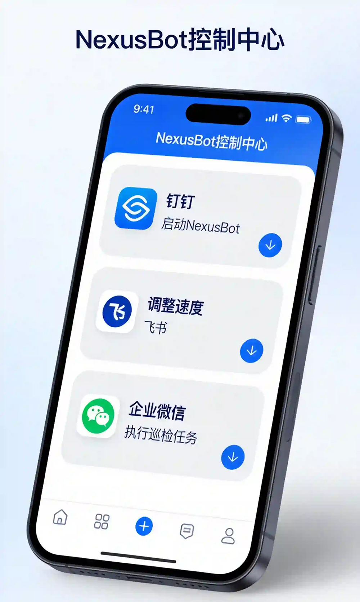

<div align="center">

# NexusBot

### 您的 24 小时 AI 员工 · 用手机指挥电脑工作


<br>

**🔥 内测席位有限，申请从速 · 本月中开放 🔥**

<br>

<a href="https://www.neuxsbot.com/download" style="display: inline-block; padding: 16px 48px; background: linear-gradient(135deg, #667eea 0%, #764ba2 100%); color: white; text-decoration: none; border-radius: 50px; font-size: 18px; font-weight: bold; box-shadow: 0 8px 20px rgba(102, 126, 234, 0.4); transition: all 0.3s ease;">
  📥 立即下载 NexusBot
</a>

<br><br>

[](https://openclaw.ai/)
[]()
[]()
[]()

[简体中文](./README.md) · [English](./README.en.md) · [日本語](./README.ja.md)

**官网：[www.neuxsbot.com](https://www.neuxsbot.com)**

</div>

<br>

---

<br>

## 💡 核心理念

<div align="center">

### 🚀 手机控制电脑 · 真正的跨端远程协作



</div>

<table>
<tr>
<td width="50%" valign="top">

<div style="background: linear-gradient(135deg, #667eea 0%, #764ba2 100%); border-radius: 16px; padding: 24px; color: white;">

### 📱 手机发指令

**出差路上，用钉钉发送：**

> "帮我汇总今天项目的所有邮件，并生成一份简报发到群里"

</div>

</td>
<td width="50%" valign="top">

<div style="background: linear-gradient(135deg, #f093fb 0%, #f5576c 100%); border-radius: 16px; padding: 24px; color: white;">

### 💻 电脑自动执行

**家里的电脑自动：**

✅ 访问邮箱  
✅ 分析内容  
✅ 生成总结  
✅ 发送消息

</div>

</td>
</tr>
</table>

<br>


<div align="center">

## 🌟 四大核心能力

</div>

<br>

<table>
<tr>
<td width="25%" align="center" valign="top">

### 📱 手机控制电脑

**随时随地远程指挥**

手机成为遥控器  
电脑成为执行终端  
不再需要坐在电脑前

</td>
<td width="25%" align="center" valign="top">

### ⏰ 24小时工作

**永不停歇的自动化**

定时触发任务  
事件自动响应  
7×24 全自动运行

</td>
<td width="25%" align="center" valign="top">

### 🔄 自动工作流

**复杂任务一键化**

可视化编辑器  
拖拽式设计  
100+ 预置模板

</td>
<td width="25%" align="center" valign="top">

### 🤖 本地+云端AI

**能力与隐私平衡**

本地模型零成本  
云端模型强能力  
灵活切换使用

</td>
</tr>
</table>

<br>

---

<br>

## 🎯 典型应用场景

<div align="center">


</div>

<div style="background: linear-gradient(to right, #e0f7fa, #e1f5fe); border-radius: 16px; padding: 24px; margin: 20px 0;">

### 📊 场景一：自动生成周报

**每周五下午 6 点自动执行：**

```
手机指令 → 提取项目数据 → AI 生成总结 → 制作 PPT → 发送到群聊
```

**您只需要：** 在手机上查看结果，无需任何操作

</div>

<div style="background: linear-gradient(to right, #fff3e0, #ffe0b2); border-radius: 16px; padding: 24px; margin: 20px 0;">

### 🔔 场景二：舆情监控

**实时监控关键词，异常自动告警：**

```
监控社交媒体 → 发现负面信息 → AI 分析严重程度 → 立即通知管理员
```

**您只需要：** 收到手机通知，快速响应

</div>

<div style="background: linear-gradient(to right, #f3e5f5, #e1bee7); border-radius: 16px; padding: 24px; margin: 20px 0;">

### 💼 场景三：智能客服

**自动回复客户咨询，复杂问题转人工：**

```
客户提问 → AI 理解意图 → 自动回复常见问题 → 复杂问题通知人工
```

**您只需要：** 处理 AI 无法解决的复杂问题

</div>

<br>

---

<br>


## 🎯 内置超级技能

<div align="center">

### 20+ 专业技能 · 覆盖开发/设计/办公 · 支持自定义创建


</div>

<br>

NexusBot 内置 20+ 专业技能，每个技能都是一个专业能力模块，让 AI 掌握特定领域的知识和工具。

<br>

<table>
<tr>
<td width="50%">

### 📄 文档处理技能

<div style="background: #e3f2fd; border-radius: 12px; padding: 20px; margin: 8px;">

**docx - Word 文档处理**  
✅ 生成技术文档、需求文档  
✅ 批量提取文档关键信息  
✅ 文档格式转换和排版优化

**示例**：「根据这份代码生成 API 文档，保存为 Word 格式」

---

**xlsx - Excel 表格处理**  
✅ 数据清洗和格式化  
✅ 生成数据报表  
✅ 复杂公式计算和数据透视

**示例**：「帮我分析这份销售数据，生成月度趋势图」

---

**pptx - PowerPoint 演示文稿**  
✅ 技术分享 PPT 制作  
✅ 产品演示文稿生成  
✅ 会议汇报材料准备

**示例**：「根据这份项目总结，生成 10 页的汇报 PPT」

---

**pdf - PDF 文档处理**  
✅ 提取 PDF 中的文本和表格  
✅ 分析合同、报告等 PDF 文件  
✅ PDF 内容结构化处理

**示例**：「读取这份 PDF 合同，提取所有关键条款」

</div>

### � 开发工具技能

<div style="background: #f3e5f5; border-radius: 12px; padding: 20px; margin: 8px;">

**develop-web-game - 网页游戏开发**  
✅ 使用 HTML5 Canvas 和 JavaScript  
✅ 支持休闲、益智、动作等游戏类型  
✅ 提供完整的游戏循环和碰撞检测

**示例**：「帮我做一个打飞机小游戏，用键盘控制」

---

**playwright - 浏览器自动化**  
✅ 端到端测试脚本编写  
✅ 网页内容批量抓取  
✅ 自动化表单填写和操作

**示例**：「写一个自动化测试，检查登录流程」

---

**frontend-design - 前端设计**  
✅ 创建现代化的前端界面和组件  
✅ 响应式布局  
✅ 可访问性（a11y）支持

**示例**：「设计一个现代化的登录页面，支持深色模式」

</div>

</td>
<td width="50%">

### 🎨 设计工具技能

<div style="background: #fff3e0; border-radius: 12px; padding: 20px; margin: 8px;">

**canvas-design - Canvas 设计**  
✅ 数据可视化图表  
✅ 自定义图形绘制  
✅ 交互式画布应用

**示例**：「用 Canvas 绘制一个公司组织架构图」

</div>

### 🛠️ 实用工具技能

<div style="background: #e8f5e9; border-radius: 12px; padding: 20px; margin: 8px;">

**web-search - 网络搜索**  
✅ 让 AI 搜索互联网获取最新信息  
✅ 查找技术文档和教程  
✅ 获取实时数据和新闻

**示例**：「搜索 React 18 的新特性有哪些」

---

**create-plan - 创建计划**  
✅ 项目启动阶段的任务规划  
✅ 复杂功能的实现步骤分解  
✅ 学习路径制定

**示例**：「帮我规划一个电商网站的开发计划」

---

**skill-creator - 技能创建器** ⭐  
✅ 创建自定义技能，扩展 NexusBot 的能力  
✅ 为特定业务场景定制技能  
✅ 集成自己的工具和流程  
✅ 构建团队专属的技能库

**示例**：「创建一个技能，用于生成我们公司格式的测试用例」

</div>

### 🌐 8000+ 生态技能

<div style="background: #fce4ec; border-radius: 12px; padding: 20px; margin: 8px;">

继承 OpenClaw 完整生态，持续增加中：

**1Password** - 密码管理集成  
**GitHub** - 代码仓库管理  
**Jira** - 项目管理  
**Slack** - 团队协作  
**Apple Notes** - 笔记同步  
**更多...** 8000+ 技能等你探索

</div>

</td>
</tr>
</table>

<br>

<div style="background: linear-gradient(to right, #e0f7fa, #e1f5fe); border-radius: 16px; padding: 24px; margin: 20px 0;">

### 💡 技能使用示例

**场景：数据分析报告生成**

1. 启用 xlsx 和 docx 技能
2. 上传销售数据 Excel 文件
3. 输入：「分析这份销售数据，找出 Top 10 产品和销售趋势，生成包含图表的 Word 报告」
4. AI 自动完成：读取数据 → 计算指标 → 生成图表 → 输出报告

**预计耗时：5-10 分钟**（传统方式可能需要 1-2 小时）

</div>

<br>

---

<br>

## 🌉 智能桥接器

<div align="center">

### 手机远程控制电脑 · 随时随地办公


</div>

<br>

通过桥接器配置，你可以在手机端通过钉钉、飞书等 IM 平台远程操控 NexusBot，实现真正的移动办公。

<table>
<tr>
<td width="50%">

### 📱 支持平台

<div style="background: #e3f2fd; border-radius: 12px; padding: 20px; margin: 8px;">

**钉钉 (DingTalk)**  
✅ Stream 模式实时通信  
✅ AI Card 流式输出  
✅ 支持单聊和群聊

**飞书 (Feishu/Lark)**  
✅ 长连接模式  
✅ 完整功能支持  
✅ 企业级稳定

</div>

</td>
<td width="50%">

### 🎯 使用场景

<div style="background: #f3e5f5; border-radius: 12px; padding: 20px; margin: 8px;">

**出差路上**  
手机发送指令，家里电脑自动执行

**通勤时间**  
地铁上处理工作，办公室电脑完成任务

**随时随地**  
7×24 小时待命，不受地点限制

</div>

</td>
</tr>
</table>

<br>

<div style="background: linear-gradient(to right, #fff3e0, #ffe0b2); border-radius: 16px; padding: 24px; margin: 20px 0;">

### 💡 桥接器工作流程

**手机端（钉钉/飞书）**  
→ 发送指令：「帮我汇总今天的邮件并生成简报」

**电脑端（NexusBot）**  
→ 自动接收指令 → 执行任务 → 生成结果

**手机端**  
→ 接收结果通知 → 查看完成的简报

**配置简单**：只需在 NexusBot 中填入机器人凭证，即可开始使用

</div>

<br>

---

<br>

## 🛡️ 沙箱安全模式

<div align="center">

### 隔离环境执行代码 · 保护系统安全

</div>

<br>

沙箱模式让 AI 在隔离的虚拟环境中执行代码，保护你的系统安全。

<table>
<tr>
<td width="50%">

### 🔒 安全特性

<div style="background: #e3f2fd; border-radius: 12px; padding: 20px; margin: 8px;">

**VM 虚拟环境**  
代码在独立环境中运行

**访问限制**  
限制对本地文件系统的访问

**网络监控**  
网络请求受到监控和限制

**风险检测**  
自动检测潜在的危险操作

</div>

</td>
<td width="50%">

### 🎯 执行模式

<div style="background: #f3e5f5; border-radius: 12px; padding: 20px; margin: 8px;">

**自动模式（推荐）**  
优先使用沙箱，不可用时回退本地

**本地运行**  
直接在本机执行，性能最佳

**仅沙箱（最高安全）**  
强制使用沙箱，拒绝本地执行

</div>

</td>
</tr>
</table>

<br>

<div style="background: linear-gradient(to right, #e8f5e9, #c8e6c9); border-radius: 16px; padding: 24px; margin: 20px 0;">

### 💡 适用场景

✅ 测试不确定来源或逻辑的代码  
✅ 运行第三方提供的脚本  
✅ 学习和实验新技术  
✅ 处理不受信任的数据

**首次使用**：点击「安装沙箱」按钮，系统会自动下载并配置虚拟环境（约 200MB）

</div>

<br>

---

<br>

**预计耗时：5-10 分钟**（传统方式可能需要 1-2 小时）

</div>

**NexusBot** 是基于 [OpenClaw](https://openclaw.ai/) 深度开发的中文版发行版，专为中文用户和企业打造。

OpenClaw 是由 Peter Steinberger (@steipete) 创建的开源个人 AI 助手平台，在 GitHub 上拥有超过 **100,000+ Stars**。

### 🌟 不只是汉化，而是深度定制

<table>
<tr>
<td width="33%" align="center">

**🔌 完整生态**

继承 20+ 超级内置技能与 8000+ 生态技能（持续增加中）  
社区生态不断增加  
后台一键安装

</td>
<td width="33%" align="center">

**🎨 图形化界面**

完整 GUI 配置  
可视化工作流编辑器  
开箱即用

</td>
<td width="33%" align="center">

**🇨🇳 中文优化**

原生支持钉钉/飞书/企微  
预集成国内 AI 模型  
完整中文文档

</td>
</tr>
</table>

<br>

### 🎯 解决的核心痛点

| 痛点 | OpenClaw 官方版 | NexusBot 解决方案 |
|------|----------------|------------------|
| 🔧 **安装复杂** | 需要命令行、配置环境变量 | ✅ 双击 EXE 即可，零门槛 |
| 🌐 **中文支持差** | 英文界面，中文文档缺失 | ✅ 完整中文界面和文档 |
| 💬 **国内平台不支持** | 只支持 Telegram/Discord | ✅ 原生支持钉钉/飞书/企微 |
| 🔑 **API 配置难** | 手动编辑配置文件 | ✅ 图形化配置，一键测试 |
| 💰 **成本高** | 依赖国外 API，费用高 | ✅ 支持本地模型，完全免费 |
| 🔒 **隐私担忧** | 数据发送到云端 | ✅ 本地模型，数据不出本地 |

<br>

---

<br>

## 🚀 工作流：让复杂任务"一键化"

<div align="center">

### 💡 工作流是 NexusBot 的核心能力

**将需要多个步骤的任务串联成一个"技能"**

</div>

<br>

<table>
<tr>
<td width="50%">

### 🎨 可视化编辑器

- **拖拽式设计** - 像搭积木一样创建工作流
- **丰富的节点** - 触发器、AI、数据处理、通知等
- **实时预览** - 边编辑边测试
- **模板库** - 100+ 预置模板，一键使用

</td>
<td width="50%">

### 🔧 支持的节点类型

- **触发器** - 定时、消息、Webhook、文件变化
- **AI 处理** - 对话、总结、翻译、分类、提取
- **数据操作** - 筛选、转换、合并、去重
- **外部服务** - 钉钉、飞书、企微、邮件、数据库
- **逻辑控制** - 条件判断、循环、延迟、并行

</td>
</tr>
</table>

<br>

### 📦 常用工作流模板

<br>

<table>
<tr>
<td width="50%" valign="top">

#### 🤖 智能客服

- 自动回复常见问题
- 复杂问题转人工
- 24小时在线服务

<br>

#### 📊 日报生成

- 自动汇总数据
- 生成日报并发送
- 定时执行无需人工

<br>

#### 🔍 舆情监控

- 监控关键词
- 异常情况自动告警
- 实时响应

</td>
<td width="50%" valign="top">

#### 📄 文档处理

- 批量处理文档
- 提取关键信息
- 自动分类归档

<br>

#### 📅 会议助手

- 会议记录→总结
- 待办事项→提醒
- 全程自动化

<br>

#### 📧 邮件管理

- 自动分类邮件
- 提取重要信息
- 智能回复

</td>
</tr>
</table>

<br>

---

<br>


## 🤖 AI 模型：本地与云端的完美平衡

<div align="center">

### 根据任务需求，灵活选择最合适的 AI 模型

</div>

<br>

<table>
<tr>
<td width="50%">

<div style="background: linear-gradient(135deg, #667eea 0%, #764ba2 100%); border-radius: 16px; padding: 24px; color: white; margin: 8px;">

### 🏠 本地模型

**完全免费 · 数据不出本地 · 无限制使用**

#### 优势

- 🔒 **绝对隐私** - 企业机密完全安全
- 💰 **零成本** - 无需购买 API
- 🚀 **响应更快** - 无网络延迟
- 🌐 **离线可用** - 无需互联网
- 📊 **无限制** - 想用多少用多少

#### 推荐模型

- **Qwen2.5** - 中文能力强
- **DeepSeek-Coder** - 代码能力优秀
- **Llama 3** - 综合能力强

#### 支持工具

- **Ollama** - 命令行工具
- **LM Studio** - 图形化界面
- **LocalAI** - API 兼容

</div>

</td>
<td width="50%">

<div style="background: linear-gradient(135deg, #f093fb 0%, #f5576c 100%); border-radius: 16px; padding: 24px; color: white; margin: 8px;">

### ☁️ 云端模型

**强大能力 · 企业级稳定 · 按需付费**

#### 优势

- 🧠 **强大能力** - 处理复杂任务
- 📈 **持续更新** - 模型不断进化
- 🌍 **多模态** - 文本/图片/语音
- ⚡ **无需硬件** - 不占用本地资源

#### 🇨🇳 中文 AI 模型（推荐）

- **DeepSeek** - ¥1/百万tokens
- **豆包** - ¥0.8/百万tokens
- **通义千问** - ¥2/百万tokens
- **智谱 GLM** - ¥5/百万tokens
- **Kimi** - ¥12/百万tokens

#### 🌍 国际 AI 模型

- **OpenAI GPT-4**
- **Anthropic Claude**
- **Google Gemini**
- **Mistral**

</div>

</td>
</tr>
</table>

<br>

---

<br>

## 📊 智能硬件检测

<div align="center">

### 自动检测硬件配置 · 推荐最适合的 AI 模型

</div>

<br>

<table>
<tr>
<td width="25%" align="center">

<div style="background: #e3f2fd; border-radius: 12px; padding: 20px; margin: 8px;">

### 🔍 自动检测

CPU 信息  
内存容量  
显卡信息  
磁盘空间  
系统信息

</div>

</td>
<td width="25%" align="center">

<div style="background: #f3e5f5; border-radius: 12px; padding: 20px; margin: 8px;">

### ⭐ 性能评分

综合评分 0-100  
AI 推理能力  
推荐等级  
入门/标准/专业/旗舰

</div>

</td>
<td width="25%" align="center">

<div style="background: #fff3e0; border-radius: 12px; padding: 20px; margin: 8px;">

### 🎯 智能推荐

入门级 → 3B 模型  
标准级 → 7B 模型  
专业级 → 13B-30B  
旗舰级 → 70B+

</div>

</td>
<td width="25%" align="center">

<div style="background: #e8f5e9; border-radius: 12px; padding: 20px; margin: 8px;">

### 📄 导出报告

一键导出  
PDF/HTML 格式  
性能建议  
升级方案

</div>

</td>
</tr>
</table>

<br>

---

<br>

## 📦 快速安装

<div align="center">

### Windows / macOS / Linux · 一键安装 · 开箱即用

</div>

<br>

### Windows 用户（推荐）

<div align="center">

<div style="background: #e3f2fd; border-radius: 12px; padding: 20px; margin: 8px; max-width: 600px;">

### 📥 一键安装

**推荐所有用户**

✅ 自动安装到系统  
✅ 创建桌面快捷方式  
✅ 系统集成更好

[**立即下载**](https://www.neuxsbot.com/download)

</div>

</div>

<br>

### 其他平台

**Linux / macOS:**

[**访问官网下载**](https://www.neuxsbot.com/download)

<br>

---

<br>


## 🚀 快速开始

<div style="background: linear-gradient(to right, #e0f7fa, #e1f5fe); border-radius: 16px; padding: 24px; margin: 20px 0;">

### 1️⃣ 安装并启动

安装完成后，NexusBot 会自动启动配置向导

### 2️⃣ 选择 AI 模型

选择本地模型（免费）或在线模型（按需付费）

### 3️⃣ 配置消息平台

选择钉钉、飞书或企业微信，按照向导完成配置

### 4️⃣ 开始使用

在手机上打开钉钉/飞书/企微，搜索你的机器人，开始对话！

</div>

<br>

### 📱 消息平台配置指南

<table>
<tr>
<td width="33%" align="center">

<div style="background: #e3f2fd; border-radius: 12px; padding: 20px; margin: 8px;">

### 钉钉

支持 AI Card 流式输出  
体验最佳

[📖 配置指南](https://www.neuxsbot.com/docs)

</div>

</td>
<td width="33%" align="center">

<div style="background: #f3e5f5; border-radius: 12px; padding: 20px; margin: 8px;">

### 飞书

完整功能支持  
企业级稳定

[📖 配置指南](https://www.neuxsbot.com/docs)

</div>

</td>
<td width="33%" align="center">

<div style="background: #fff3e0; border-radius: 12px; padding: 20px; margin: 8px;">

### 企业微信

支持主动发送  
灵活性更强

[📖 配置指南](https://www.neuxsbot.com/docs)

</div>

</td>
</tr>
</table>

<br>

### 🎯 消息平台功能对比

| 功能 | 钉钉 | 飞书 | 企业微信 |
|------|:----:|:----:|:--------:|
| 文本消息 | ✅ | ✅ | ✅ |
| Markdown | ✅ | ✅ | ✅ |
| 流式响应 | ✅ AI Card | 🚧 开发中 | ✅ |
| 图片/文件 | ✅ | ✅ 接收 | ✅ |
| 语音消息 | ✅ | 🚧 开发中 | ✅ 接收 |
| 私聊 | ✅ | ✅ | ✅ |
| 群聊 | ✅ | ✅ | ✅ |
| @机器人 | ✅ | ✅ | ✅ |
| 主动发送 | ❌ | ❌ | ✅ |

💡 **钉钉 AI Card** 支持打字机效果的流式输出，体验最佳！

<br>

---

<br>

## � 完整文档

<table>
<tr>
<td width="50%">

### 📖 基础文档

- [完整文档](https://www.neuxsbot.com/docs)

</td>
<td width="50%">

### 📱 平台配置

- [查看完整配置指南](https://www.neuxsbot.com/docs)

</td>
</tr>
</table>

<br>

---

<br>


## ❓ 常见问题

<details>
<summary><strong>Q: NexusBot 和 OpenClaw 官方版有什么区别？</strong></summary>

<br>

NexusBot 完全基于 OpenClaw 官方版本，并针对中国用户优化：

- ✅ 一键安装，无需命令行
- ✅ 原生支持钉钉/飞书/企微
- ✅ 预集成中国 AI 模型
- ✅ 完整图形化配置界面
- ✅ 完整中文文档

</details>

<details>
<summary><strong>Q: 需要什么配置要求？</strong></summary>

<br>

- **操作系统**: Windows 10/11, macOS 10.15+, Linux
- **内存**: 建议 4GB 以上
- **磁盘**: 至少 2GB 可用空间
- **网络**: 需要访问 AI 模型 API（本地模型可离线）

</details>

<details>
<summary><strong>Q: 数据安全吗？</strong></summary>

<br>

- ✅ 所有数据存储在本地
- ✅ 不会上传到任何服务器
- ✅ AI 对话通过官方 API，遵循各平台隐私政策
- ✅ 使用本地模型时，数据完全不出本地

</details>

<details>
<summary><strong>Q: 如何更新到最新版？</strong></summary>

<br>

- **Windows/macOS/Linux**: 访问[官网下载中心](https://www.neuxsbot.com/download)下载最新版本覆盖安装
- **Docker**: `docker pull markovmodcn/nexusbot:latest`

</details>

<details>
<summary><strong>Q: 机器人没有回复怎么办？</strong></summary>

<br>

检查清单：

1. 确认服务正在运行
2. 检查 AI 模型 API Key 是否正确
3. 检查消息平台配置是否正确
4. 查看日志文件排查错误

</details>

<details>
<summary><strong>Q: 可以同时使用多个消息平台吗？</strong></summary>

<br>

可以！NexusBot 支持同时配置钉钉、飞书和企业微信，您可以在不同平台上使用同一个 AI 助手。

</details>

<details>
<summary><strong>Q: 本地模型和云端模型可以混用吗？</strong></summary>

<br>

可以！您可以为不同的任务配置不同的模型：

- 敏感数据处理 → 使用本地模型
- 复杂任务处理 → 使用云端模型
- 高频简单任务 → 使用本地模型节省成本

</details>

<br>

---

<br>

## 💡 为什么选择闭源发布？

<div style="background: linear-gradient(to right, #fff3e0, #ffe0b2); border-radius: 16px; padding: 24px; margin: 20px 0;">

### 🛡️ 保护用户，防止被不良商家利用

NexusBot 基于开源项目 OpenClaw 深度开发，我们深知开源的价值。但在发布方式上，我们选择了**闭源发布**（只提供安装包，不公开源代码）。

#### 为什么做这个决定？

- 🛡️ **防止倒卖牟利** - 一旦公开源代码，就会有人拿去包装售卖，打着"官方"旗号欺骗用户
- 🛡️ **保护用户利益** - 避免用户花冤枉钱购买本应免费的软件
- 🛡️ **确保软件安全** - 防止被植入恶意代码后重新分发
- 🛡️ **维护项目声誉** - 避免劣质修改版损害 NexusBot 和 OpenClaw 的声誉

#### 我们的承诺

- ✅ **所有基础功能完全免费** - 安装、配置、使用，20+ 超级内置技能与 8000+ 生态技能（持续增加中）
- ✅ **开箱即用** - 傻瓜式安装，去掉繁琐配置，让真正需要的人能轻松使用
- ✅ **官方唯一渠道** - GitHub: [Markovmodcn/openclaw-china](https://github.com/Markovmodcn/openclaw-china)
- ✅ **自研且与官方深度对接** - 持续优化改进，保持技术领先

#### ⚠️ 警惕收费版本

如果有人向你收费售卖 NexusBot，请认准官方渠道。**所有功能永久免费，拒绝被割韭菜！**

</div>

<br>

---

<br>

## 🔗 相关链接

<table>
<tr>
<td width="50%">

### NexusBot

- 🌐 [官网](https://www.neuxsbot.com)
- 📦 [下载中心](https://www.neuxsbot.com/download)
- 📚 [完整文档](https://www.neuxsbot.com/docs)
- 🐛 [问题反馈](https://github.com/Markovmodcn/openclaw-china/issues)

</td>
<td width="50%">

### OpenClaw 官方

- 🌐 [OpenClaw 官网](https://openclaw.ai/)
- 💻 [OpenClaw GitHub](https://github.com/openclaw/openclaw)
- 📖 [OpenClaw 文档](https://openclaw.ai/docs)
- 💬 [OpenClaw Discord](https://discord.gg/openclaw)

</td>
</tr>
</table>

<br>

---

<br>

## 💬 支持与反馈

<div align="center">

### 问题反馈

🐛 [GitHub Issues](https://github.com/Markovmodcn/openclaw-china/issues) - 提交 Bug 或功能建议

💬 **微信用户群** - 扫码加入，获取实时帮助


<br><br>

---

<br>

### 如果 NexusBot 帮到了你，欢迎支持项目


<br>

*您的支持让我们能持续提供免费、优质的服务 ❤️*

*一起守护开源，让 AI 助手真正普及，而不是成为敛财工具 💪*

</div>

<br>

---

<br>

## 📄 许可证

本项目基于 OpenClaw 开源项目，采用商业许可。

OpenClaw 原项目由 Peter Steinberger 创建，版权归原作者所有。

<br>

---

<br>

<div align="center">


<br><br>

**NexusBot - 让 OpenClaw 在中国更好用**

**Made with ❤️ based on [OpenClaw](https://openclaw.ai/)**

<br>

---

<br>

**手机指令 → 自动执行复杂工作流 → 调用本地或云端AI → 24小时不间断运行 → 结果返回手机**

</div>
