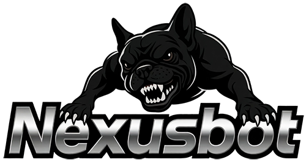

  

# NEUXSBOT
### OpenClaw 中国版
### 图形化一键安装的 AI 操作系统

[English](./README.en.md)

---

## 软件定位

NEUXSBOT 是基于 OpenClaw 深度优化的中国版本，定位为新一代 AI 操作系统。  
它不是单一聊天工具，而是面向真实任务的执行系统，强调从目标理解、任务拆解、能力调用到结果交付的完整闭环。

根据本地产品文档与前端实现，NEUXSBOT 的核心目标是：

- 7×24 小时持续执行复杂任务
- 代码开发与自动化优先
- 多模型与技能协同
- 本地部署与安全可控

---

## 核心功能总览

### 1. IDE 开发与代码执行（重点）

NEUXSBOT 内置 `NEUXSBOT IDE`，用于真实开发场景的持续协作。

- 从自然语言需求生成可执行代码
- 支持多轮迭代与增量修改
- 结合任务上下文持续重构与补全
- 支持前端开发、自动化脚本、测试脚本等任务

典型流程：

1. 描述开发目标
2. 生成初版代码
3. 追加约束和规范
4. 自动修订
5. 迭代到可交付结果

---

### 2. 智能对话与任务管理

NEUXSBOT 的对话界面是工作中心，强调“可持续上下文”。

- 上下文理解：记住前后文关系
- 文件上传：支持直接分析文件
- 多轮协作：支持反复修正同一任务
- 任务历史：自动保存、检索、续接任务
- 任务操作：重命名、置顶、删除等管理能力

---

### 3. 技能系统（可扩展能力层）

技能系统是 NEUXSBOT 的执行能力放大器。每个技能聚焦一个专业方向，可按任务启用。

文档与办公技能：

- `docx`：Word 文档生成与提取
- `xlsx`：表格处理、分析、报表
- `pptx`：演示文稿生成
- `pdf`：PDF 读取、结构化提取

开发与自动化技能：

- `frontend-design`：前端页面与组件设计
- `playwright`：浏览器自动化与测试
- `develop-web-game`：网页游戏开发

实用与扩展技能：

- `web-search`：联网检索与资料补充
- `create-plan`：任务分解与实施计划
- `skill-creator`：创建团队自定义技能

---

### 4. 典型工作流能力

本地文档给出的典型流程覆盖真实生产任务：

- 数据分析报告自动生成
- 前端组件快速开发与迭代
- E2E 自动化测试脚本编写
- 多格式文档抽取与转换

NEUXSBOT 的特点不是“单次回答”，而是“按步骤持续推进任务并输出结果”。

---

### 5. 多模型系统与本地部署

NEUXSBOT 支持多模型提供商接入，并支持本地模型部署。

云端模型方向（示例）：

- OpenAI
- Anthropic
- Google
- DeepSeek
- Moonshot
- Qwen
- GLM
- MiniMax
- OpenRouter

本地模型方向：

- Ollama 本地部署
- 本地模型可离线使用
- 适用于隐私敏感或内网场景

---

### 6. 桥接器远程协作（IM 接入）

通过桥接器，NEUXSBOT 可与 IM 平台联动，实现移动端远程操作桌面执行。

当前文档中明确支持：

- 钉钉（DingTalk）
- 飞书（Feishu / Lark）

能力特征：

- 机器人接入配置
- 消息收发链路
- 企业场景远程操控
- 多平台并行配置

---

### 7. 沙箱安全执行

NEUXSBOT 提供沙箱执行机制，用于隔离不可信代码或脚本。

执行模式：

- 自动模式（优先沙箱）
- 本地运行模式
- 仅沙箱模式

安全目标：

- 隔离执行环境
- 控制文件系统访问
- 限制高风险操作
- 在安全与效率之间提供可配置平衡

---

### 8. 数据分析系统（独立产品模块）

NEUXSBOT 包含“数据分析系统”模块，强调模型融合与验证闭环。

公开功能描述涉及：

- 多维概率模型分析
- 特征工程与模型集成
- 历史回测与验证流程
- 可视化分析输出

公开技术方向包含：

- 马尔可夫链
- LSTM
- XGBoost

---

### 9. 多平台安装与启动

NEUXSBOT 提供图形化安装入口与跨平台支持：

- Windows
- macOS
- Linux

同时支持命令行快速安装方式，适合自动化部署或高级用户场景。

---

## 架构与能力示意

  

  

  

---

## 仓库说明

本仓库用于 NEUXSBOT 软件功能介绍与公开文档入口。  
当前不包含完整业务源码实现。

---

## 链接与反馈

- 官网：https://www.neuxsbot.com
- 文档：https://www.neuxsbot.com/docs
- 下载：https://www.neuxsbot.com/download
- 问题反馈：https://github.com/Markovmodcn/openclaw-china/issues

  

