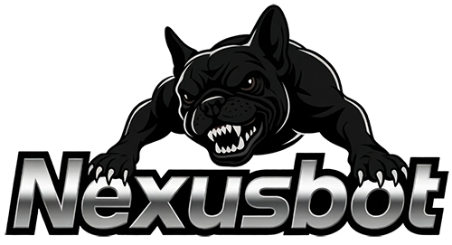
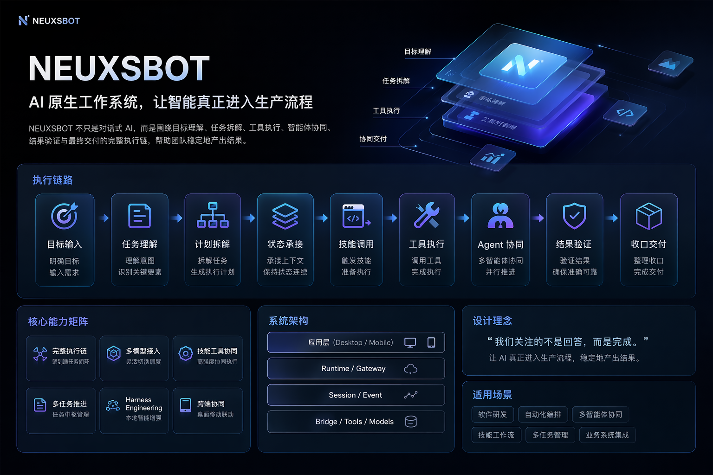
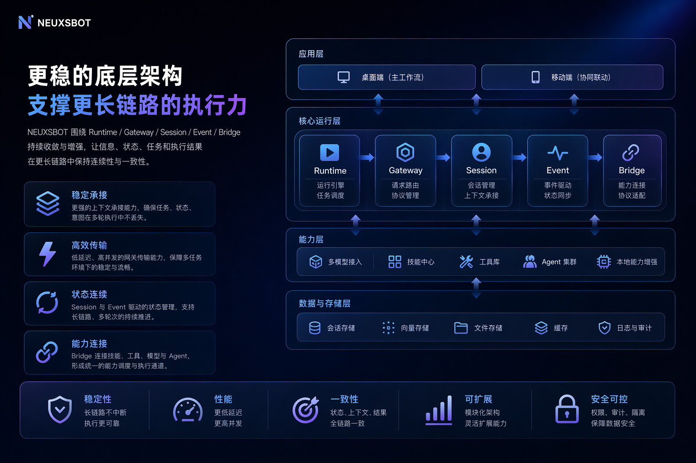
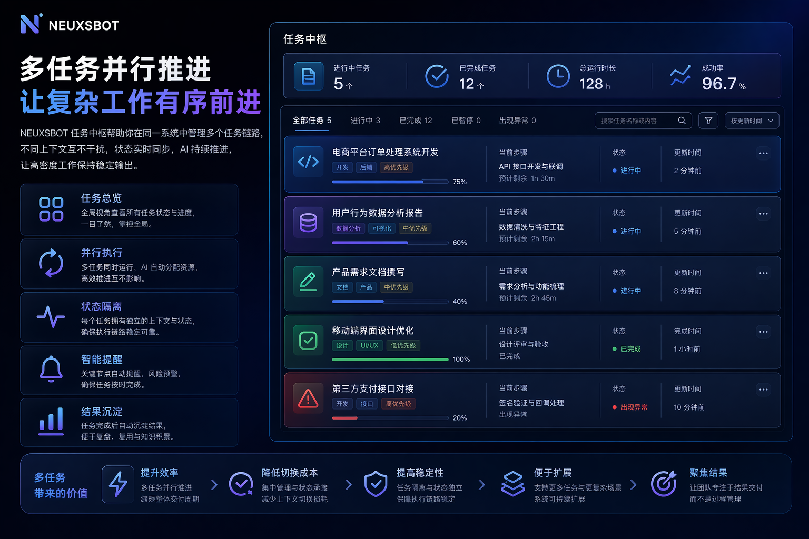
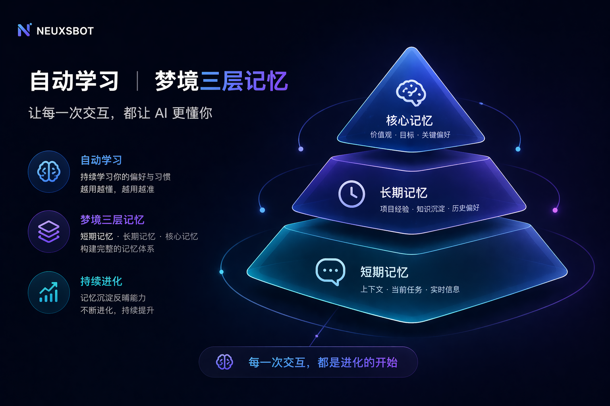
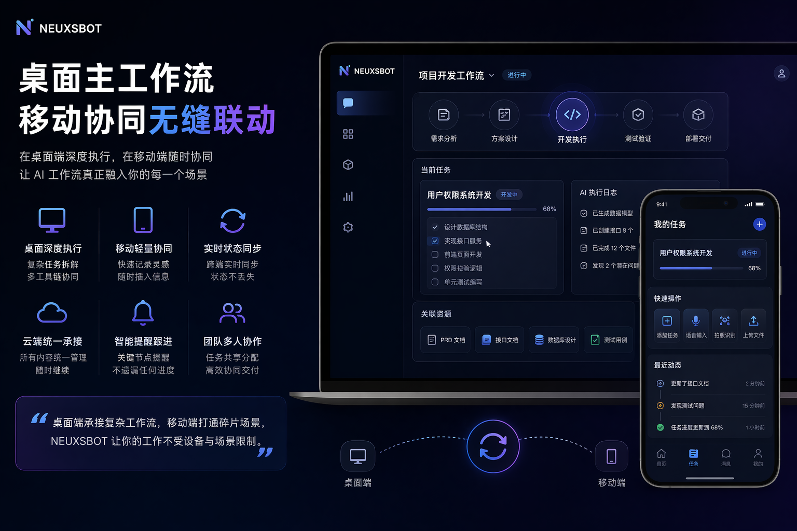
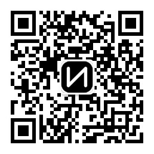

# NEUXSBOT

### OpenClaw 中文版 - 开箱即用的 AI 原生工作系统，让智能从回答走向任务理解、执行协同与结果交付

 

[简体中文](./README.md) · [English](./README.en.md)

**官网：** [https://www.neuxsbot.com](https://www.neuxsbot.com)  
**下载：** [https://www.neuxsbot.com/download](https://www.neuxsbot.com/download)

---

## 产品定位

**NEUXSBOT 是一套面向真实研发、真实协作、真实交付场景持续演进的 AI 原生工作系统。**

它不是只负责对话的一次性助手，也不是停留在演示层的轻量化 AI 工具。  
NEUXSBOT 的价值，在于把 AI 能力真正推进到完整工作链中，让智能不再只负责“给出答案”，而是能够围绕目标理解、任务拆解、上下文承接、工具执行、智能体协同、结果验证与最终交付持续工作。

从桌面工作流到移动协同，从多模型接入到多任务推进，从技能调用到工具闭环，从会话状态承接到执行链收口，NEUXSBOT 更关注的是整条工作主链的稳定性、执行力与持续演进能力。

一句话概括：

> **NEUXSBOT 要做的，不是让 AI 看起来更热闹，而是让 AI 真正进入生产流程，稳定地产出结果。**

  

---

## 为什么 NEUXSBOT 更强

决定 AI 产品上限的，从来不只是模型本身，而是整套系统是否具备真正落地的能力：

- 能不能稳定承接上下文
- 能不能理解任务并拆解执行
- 能不能打通技能、工具与 Agent
- 能不能在多轮执行中持续推进
- 能不能把中间过程收口成可验证结果
- 能不能在桌面端与移动端之间形成顺畅协同
- 能不能支撑长期演进，而不是停留在一次性展示

NEUXSBOT 的核心竞争力，正是把这些决定真实生产力的关键链路做成体系，而不是把 AI 停留在“模型回得挺好”这一层。

---

## 核心能力矩阵

### 1. 完整执行链，而不是单轮问答

NEUXSBOT 的核心交互不是简单的“提问 - 回答”，而是完整的：

**目标输入 -> 任务理解 -> 计划拆解 -> 状态承接 -> 技能调用 -> 工具执行 -> Agent 协同 -> 结果验证 -> 收口交付**

这意味着它不仅能生成内容，更能围绕任务持续推进，让 AI 从辅助回答走向真正参与执行。

### 2. 更稳的 Runtime / Gateway / Session 主链

真正强大的 AI 系统，不只是模型更强，而是底层承接链更稳。  
NEUXSBOT 围绕 `runtime / gateway / session / event / bridge` 持续收敛与增强，让信息、状态、任务和执行结果可以在更长链路中保持连续性。

这种系统级稳定性，决定了它能不能支撑真实项目、真实团队和真实交付，而不只是完成一轮漂亮回复。

  

### 3. 技能、工具、Agent 的高强度协同

NEUXSBOT 不是把 AI 当成一个单点大模型入口，而是把技能、工具与 Agent 组织成可持续推进的工作系统。  
在复杂任务中，AI 不再只是输出建议，而是可以进入调用、执行、反馈、收口的完整闭环。

这让它更适合：

- 软件研发
- 自动化任务编排
- 多步骤执行场景
- 技能化工作流
- 多智能体协同

### 4. 多任务推进与任务中枢能力

现实工作从来不是单线程。  
NEUXSBOT 更强调多任务承接能力，让不同任务、不同上下文和不同执行链路可以在同一工作系统中被稳定管理和推进。

这让它不只是一个“聊天窗口”，而更像一个真正面向高密度生产场景的 AI 工作中枢。

  

### 5. 多模型接入与灵活切换能力

不同任务需要不同模型策略。  
NEUXSBOT 支持多模型接入与切换，让用户可以根据成本、速度、推理深度和任务类型灵活选择更合适的执行路径。

这不是简单的模型展示，而是面向真实工作流的能力调度。

### 6. Harness Engineering 与本地智能增强

NEUXSBOT 的强大，不只来自模型能力，更来自更稳的 Harness 与本地智能增强。  
它把重点放在任务拆分、上下文装配、状态管理、工具 contract、运行编排、结果收口与本地智能增强这些真正影响交付质量的层面。

这也是 NEUXSBOT 能持续变强的关键：

- 更稳的任务拆分
- 更稳的状态承接
- 更自然的技能触发
- 更强的结果收口
- 更完整的本地工作流表达

  

### 7. 桌面端主工作流与移动端联动协同

NEUXSBOT 不把桌面和移动割裂开来，而是围绕真实使用习惯构建协同链路。  
桌面端适合承接主工作流与复杂执行，移动端适合补充任务、插入信息、快速联动，二者共同组成更完整的使用场景。

对于高频使用者来说，这种协同体验比单点功能更有价值。

  

### 8. 面向中文团队的产品化表达

NEUXSBOT 更贴近中文团队的研发、沟通和交付习惯。  
它不只是语言层面的本地化，而是围绕中文用户真实使用路径做产品级承接，包括：

- 更直观的产品结构
- 更符合中文团队习惯的工作表达
- 更完整的桌面端壳与任务组织
- 更适合本地业务环境的协同方式

---

## 我们关注的不是回答，而是完成

NEUXSBOT 要解决的，不是“AI 能不能再多说一点”，而是：

- AI 能不能更稳定地承接任务
- AI 能不能更准确地连接技能、工具和 Agent
- AI 能不能在复杂链路中持续推进
- AI 能不能在多任务环境下保持执行力
- AI 能不能把过程真正收口成结果
- AI 能不能成为真实生产系统的一部分

当很多产品还把价值停留在回复质量时，NEUXSBOT 更看重的是执行强度、系统稳定性和最终交付能力。

---

## 适用场景

NEUXSBOT 适合用于以下类型的场景：

- 日常软件研发与代码交付
- 技术团队的 AI 增强工作流
- 多步骤自动化任务编排
- 技能 / 工具 / Agent 协同执行
- 多任务并行推进与状态管理
- 桌面端主流程执行与移动端联动协同
- 面向真实业务环境的 AI 工作系统建设

它不只是帮助用户“问一个问题”，而是在更长的工作链里帮助团队真正推进任务、沉淀结果、提升交付效率。

---

## 获取 NEUXSBOT

### 官网

- [https://www.neuxsbot.com](https://www.neuxsbot.com)

### 下载地址

- [https://www.neuxsbot.com/download](https://www.neuxsbot.com/download)

---

## 关注我们

### 公众号二维码

  

关注公众号后回复【邀请码】

---

## 总结

**NEUXSBOT 不是一个普通 AI 助手。**  
**它是一套把理解、规划、执行、协同与交付真正连接起来的 AI 原生工作系统。**
